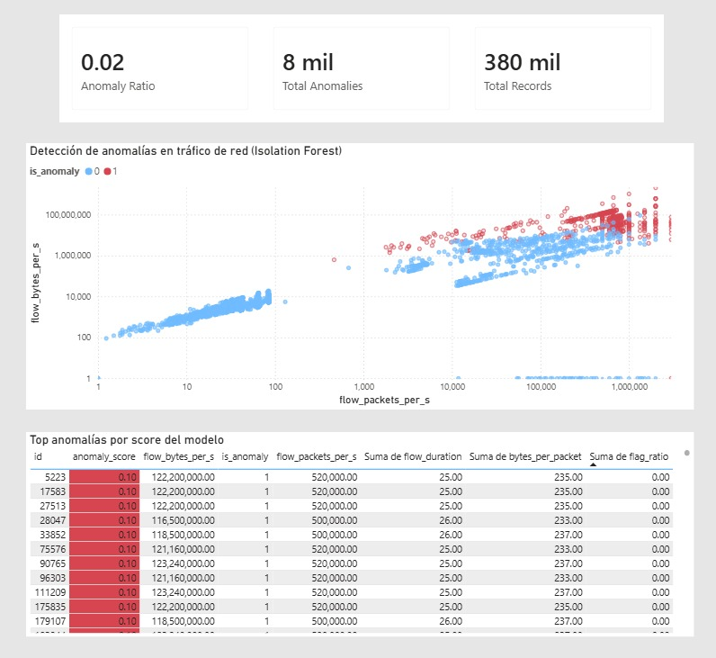
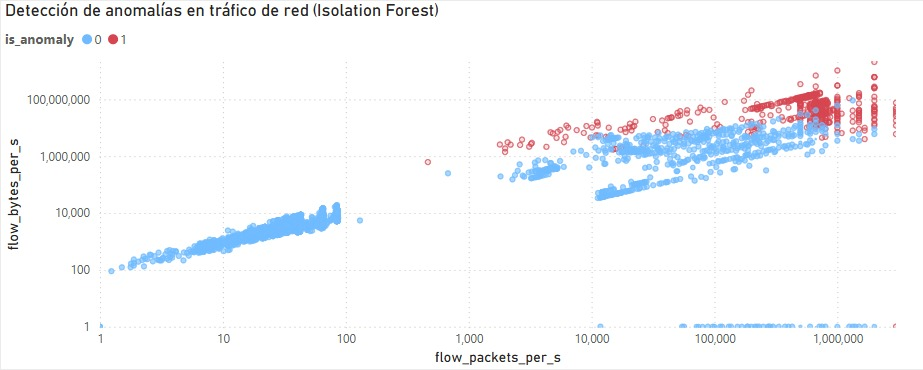
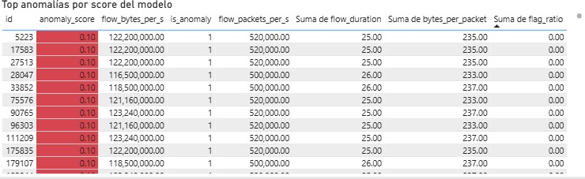

# Network Monitoring System

[](https://www.python.org/)
[](https://fastapi.tiangolo.com/)
[](https://www.postgresql.org/)
[](https://scikit-learn.org/)

## Overview 🚀

Network Monitoring System es un proyecto de punta a punta para analizar tráfico de red, detectar anomalías y exponer resultados a través de una API. Combina ETL, PostgreSQL, FastAPI e Isolation Forest en una arquitectura simple, clara y fácil de explicar en una entrevista.

## Problema 🔎

El dataset CICIDS2017 trae tráfico de red en gran volumen y con formatos que no siempre vienen listos para usar. La idea de este proyecto fue convertir esos datos en algo útil: limpiarlos, normalizarlos, asignarles un score de anomalía y dejar todo disponible para consulta y análisis.

## Arquitectura 🧱

```text
ETL (CSV / Parquet)
        |
        v
PostgreSQL (network_traffic)
        |
        v
ML Scoring (Isolation Forest)
        |
        v
PostgreSQL (network_traffic_scored)
        |
        v
FastAPI (metrics, anomalies, prediction)
```

## Stack tecnológico 🛠️

- Python 3.11
- pandas
- PostgreSQL
- psycopg2
- SQLAlchemy
- FastAPI
- Uvicorn
- scikit-learn
- joblib

## Pipeline explicado 🔁

1. El ETL lee CICIDS2017 por chunks y se queda solo con las columnas que realmente aporta valor conservar.
2. Luego normaliza etiquetas, tipos de datos y guarda la información limpia en `network_traffic`.
3. Después, el script de entrenamiento crea features derivadas y ajusta el modelo Isolation Forest.
4. El scoring toma esos registros y deja el resultado persistido en `network_traffic_scored`.
5. Finalmente, FastAPI expone todo lo anterior en endpoints pensados para exploración y consulta rápida.

## ML explicado 🤖

Para la detección de anomalías se usó Isolation Forest porque encaja bien cuando no hay etiquetas confiables en tiempo de inferencia. El modelo trabaja con métricas del flujo y también con variables derivadas:

- `bytes_per_packet`
- `fwd_bwd_ratio`
- `flag_ratio`

El score persistido indica qué tan raro se ve un registro frente al comportamiento aprendido. A partir de eso, `is_anomaly` marca la decisión final en formato binario.

## Resultados reales 📈

- Tráfico cargado en PostgreSQL: `380000` filas
- Tráfico scoreado en `network_traffic_scored`: `380000` filas
- Anomalías detectadas por ML: `7553`
- Modelo Isolation Forest persistido localmente en `ml/model.joblib`

Estos números muestran que el flujo completo quedó operativo y que la parte de scoring no quedó solo en una demo.

## Endpoints 📡

| Método | Endpoint | Propósito |
| --- | --- | --- |
| GET | `/health` | Health check local |
| GET | `/metrics/summary` | Volumen total y distribución de etiquetas |
| GET | `/metrics/advanced` | Percentiles y ratio de anomalías |
| GET | `/anomalies` | Anomalías estadísticas por z-score |
| GET | `/anomalies/ml` | Anomalías detectadas por el modelo y persistidas |
| GET | `/top_traffic` | Flujos con mayor intensidad por métrica |
| GET | `/top_suspicious` | Flujos con mayor score de anomalía |
| POST | `/predict` | Inferencia puntual con payload JSON |

### Ejemplo de `POST /predict`

```json
{
  "flow_bytes_per_s": 120000.5,
  "flow_packets_per_s": 900.1,
  "total_fwd_packets": 12,
  "total_backward_packets": 3,
  "fwd_packet_length_mean": 66.2,
  "bwd_packet_length_mean": 24.8,
  "syn_flag_count": 1,
  "ack_flag_count": 0,
  "psh_flag_count": 1,
  "urg_flag_count": 0
}
```

## Cómo ejecutar localmente 🏁

### 1. Crear `.env`

```dotenv
POSTGRES_HOST=localhost
POSTGRES_PORT=5432
POSTGRES_USER=postgres
POSTGRES_PASSWORD=postgres
POSTGRES_DB=network_monitoring_db
CSV_PATH=C:\Users\blak_\Documents\cicids2017\Benign-Monday-no-metadata.csv
CHUNK_SIZE=100000
BATCH_SIZE=5000
API_HOST=0.0.0.0
API_PORT=8000
```

### 2. Instalar dependencias

```powershell
py -3.11 -m pip install -r requirements.txt
```

### 3. Ejecutar ETL

```powershell
py -3.11 -m etl.load_data --csv-path "C:\Users\blak_\Documents\cicids2017\Benign-Monday-no-metadata.csv"
```

### 4. Entrenar el modelo

```powershell
py -3.11 .\ml\train_isolation_forest.py --sample-size 50000 --chunk-size 50000
```

### 5. Generar scoring

```powershell
py -3.11 .\ml\score_isolation_forest.py --chunk-size 100000 --replace-table
```

### 6. Levantar la API

```powershell
py -3.11 -m uvicorn api.main:app --reload
```

## Consultas SQL útiles 🗃️

```sql
SELECT COUNT(*) FROM network_traffic;
SELECT COUNT(*) FROM network_traffic_scored;
SELECT COUNT(*) FROM network_traffic_scored WHERE is_anomaly = 1;
```

## Dashboard / Power BI 📊







Abre `dashboards/traffic.pbix`, conéctalo a PostgreSQL y usa la tabla `network_traffic_scored` como fuente principal para construir el tablero.

Flujo recomendado:

1. Abrir el archivo `.pbix` en Power BI Desktop.
2. Elegir PostgreSQL como origen de datos.
3. Conectarse a la tabla `network_traffic_scored`.
4. Refrescar el modelo y publicar las visualizaciones.

## Conclusiones 

- El proyecto cubre ingestión, almacenamiento, feature engineering, scoring de anomalías, persistencia y entrega vía API.
- La capa de ML agrega detección no supervisada sin depender de etiquetas en inferencia.
- La tabla scoreada y las consultas indexadas dejan el sistema listo para monitoreo y para crecer hacia un dashboard más completo.

## Notas

- El proyecto ya funciona de punta a punta.
- Usa `network_traffic_scored` para los endpoints respaldados por ML.
- El endpoint `POST /predict` espera las variables numéricas del flujo mostradas arriba.

Si lo presentas en GitHub, este README ya cuenta la historia completa sin sonar demasiado técnico ni demasiado rígido.
